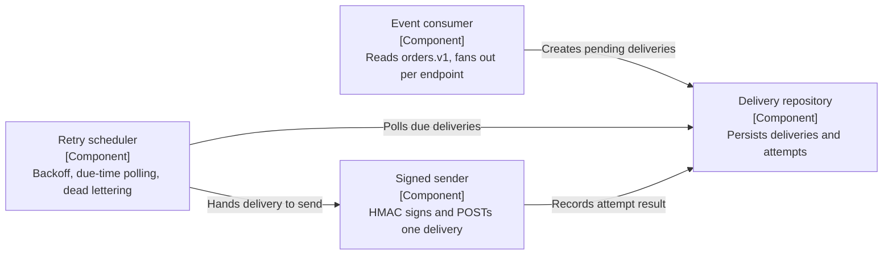

# Level 3: Components of Dispatcher

Zooms into: [Dispatcher](../2-containers.md) · Status: approved 2026-11-13

```mermaid
flowchart LR
  consumer["Event consumer<br/>[Component]<br/>Reads orders.v1, fans out per endpoint"]
  scheduler["Retry scheduler<br/>[Component]<br/>Backoff, due-time polling, dead lettering"]
  sender["Signed sender<br/>[Component]<br/>HMAC signs and POSTs one delivery"]
  repo["Delivery repository<br/>[Component]<br/>Persists deliveries and attempts"]
  consumer -->|"Creates pending deliveries"| repo
  scheduler -->|"Polls due deliveries"| repo
  scheduler -->|"Hands delivery to send"| sender
  sender -->|"Records attempt result"| repo
```
